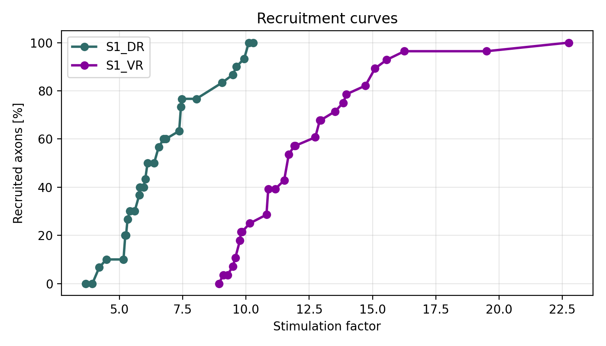
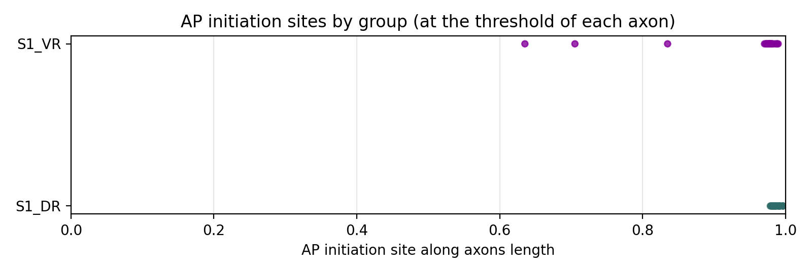
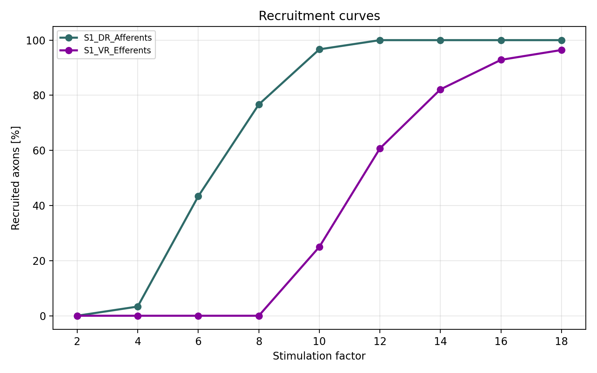
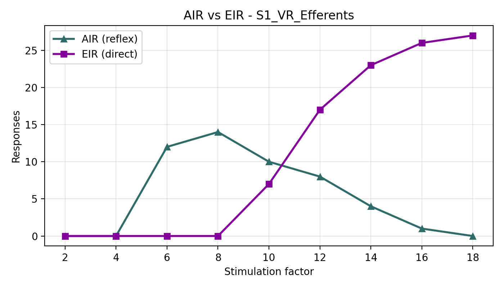

# Overview

The Python Neurostimulation Simulator (PyNS) is a Python-based computational framework for simulating interactions between neurostimulation paradigms and neural structures.

The first public release of PyNS accompanies the publication [insert DOI link] and provides several tools to facilitate virtual prototyping of neurostimulation paradigms. These include the simulation of axonal responses to externally applied electric fields, homonymous monosynaptic transmission between somatosensory afferents and motor efferents, and several other utilities.


Below, we provide brief instructions to install the PyNS framework, run example tests that reproduce selected published simulations, and set up the codebase for future exploration and development of neurostimulation paradigms.

## Installation

The installation of the PyNS framework is described below as a step-by-step process. Before installation, Python must be available (Step 0). An MPI installation (Step 1) is highly recommended to levarage parallel processing support in the simualtion scripts. Once these prerequisites are satisfied, the PyNS framework can be installed (Steps 2 and 3). Common installation issues and troubleshooting guidance are also provided for different steps.

### Step 0: Dependencies

PyNS is installable as a standard Python package in accordance with PEP 518. Prior to installation, Python must be available on the system:

- Install Python == 3.12:

   **Option A: Anaconda/Miniconda (recommended)**
   - Install Anaconda from the [official site](https://www.anaconda.com/download) (or Miniconda from [here](https://docs.conda.io/en/latest/miniconda.html))
   - Open a terminal and install python3.12 by running:
   ```bash
   conda install -c conda-forge python=3.12
   ```
   Or create a virtual environment with Python=3.12 by running:
   ```bash
   conda create -n pyns python=3.12
   conda activate pyns
   ```

   **Option B: System Python**
   - Follow the [official Python instructions](https://docs.python.org/3/using/index.html) for your OS to install Python 3.12.

   **Verify installation:**
   - Open a terminal and run:
   ```bash
   python3.12 --version
   python -c "import sys; print(sys.version)"
   ```
   You should see a version string that starts with 3.12 (for example, 3.12.x).

Once Python is installed and verified, you may proceed to Step 1.

### Step 1 (optional): MPI installation and verification

PyNS supports parallel execution. Although not a must, we highly recommend using this feature to speed up simulations. MPI installation procedures depend on the operating system. Platform-specific instructions are provided for macOS, Linux, and Windows below.

**Pick one MPI and stick to it:** To avoid conflicts, install a single MPI stack and ensure its `mpicc`/`mpirun` are first on `PATH` when you install and run PyNS. Easiest path for new users: use the conda-forge `openmpi` + `mpi4py` combo and avoid mixing with any preinstalled MPI.

- **macOS:**

   An MPI implementation can be installed using either Homebrew or Anaconda.
	
	- Install MPI:

      **Option A: Homebrew**
		- Run the following in the terminal:
		```bash
		brew install open-mpi
		```

      **Option B: Anaconda/Miniconda**
		- Run the following in the terminal:
		```bash
		conda install -c conda-forge openmpi
		```
	- Expose library files:

		- For Intel macOS: Inside the terminal, run the following:
		`export DYLD_LIBRARY_PATH=/usr/local/lib:$DYLD_LIBRARY_PATH`
		- For Apple Silicon:  Inside the terminal, run the following:
		`export DYLD_LIBRARY_PATH=/opt/homebrew/lib:$DYLD_LIBRARY_PATH`

- **Linux:**

   **Option A: apt-get (Debian/Ubuntu)**
   - Run the following in the terminal:
   ```bash
   sudo apt-get install -y libopenmpi-dev openmpi-bin
   ```

   **Option B: Anaconda/Miniconda**
   - Run the following in the terminal:
   ```bash
   conda install -c conda-forge openmpi
   ```

- **Windows:**
   - Please use [WSL](https://learn.microsoft.com/en-us/windows/wsl/install) and follow the same instructions listed for Linux above.

### Step 2 (optional): Virtual environment for managing python packages

It is recommended to create a virtual environment for easier management of the installed Python packages. There are 3 different options to choose from for setting up a virtual environment.

**Option A: Conda virtual environment (recommended)**
- Please first install [Anaconda](https://www.anaconda.com/download) or [Miniconda](https://docs.conda.io/en/latest/miniconda.html) to use this option.
- After Anaconda or Miniconda is installed, open a terminal and run:

	**Note: Please skip the first two commands if a conda environment was already installed and activated in Step0 (Option A).**
```bash
conda create -n pyns python=3.12
conda activate pyns
conda install pip
```
- Install all core dependencies with conda (recommended before pip installing PyNS):
```bash
conda install -c conda-forge numpy scipy h5py mpi4py openmpi matplotlib pyvista pyyaml neuron==8.2.4
```
- To support parallel processing (optional), install Python MPI bindings (mpi4py):
```bash
conda install -c conda-forge mpi4py
```
   - Direct, conflict-free path: install the full conda-forge stack and use it exclusively:
   ```bash
   conda install -c conda-forge openmpi mpi4py
   ```
   Make sure this conda environment is active whenever you run PyNS.

**Option B: Python venv**
- Run the following in the terminal:
```bash
python3.12 -m venv pyns_env
source pyns_env/bin/activate  # On Windows: pyns_env\Scripts\activate
```
- To support parallel processing (optional), install Python MPI bindings (mpi4py):
```bash
pip install --no-binary=mpi4py mpi4py
```
   - If you already have MPI installed, point mpi4py to the exact compiler before installing:
   ```bash
   export MPICC=$(command -v mpicc)
   pip install --no-binary=mpi4py mpi4py
   ```
   - If you want a clean setup with no system conflicts, first install a fresh MPI (e.g., conda-forge `openmpi`) and ensure its `bin` directory is first on `PATH` when running the pip install. Example:
   ```bash
   export PATH="$HOME/miniconda3/envs/pyns/bin:$PATH"  # adjust to your conda env path
   pip install --no-binary=mpi4py mpi4py
   ```

**Option C: Virtualenv**
- Open a terminal and run:
```bash
pip install virtualenv
virtualenv -p python3.12 pyns_env
source pyns_env/bin/activate  # On Windows: pyns_env\Scripts\activate
```
- To support parallel processing (optional), install Python MPI bindings (mpi4py):
```bash
pip install --no-binary=mpi4py mpi4py
```
   - If you have an MPI already, lock mpi4py to it during install:
   ```bash
   export MPICC=$(command -v mpicc)
   pip install --no-binary=mpi4py mpi4py
   ```
   - For the simplest, conflict-free route, install a clean MPI (e.g., conda-forge `openmpi`) and put its `bin` directory first on `PATH` while installing and running PyNS. Example:
   ```bash
   export PATH="$HOME/miniconda3/envs/pyns/bin:$PATH"  # adjust to your conda env path
   pip install --no-binary=mpi4py mpi4py
   ```

**MPI Verification (all platforms, optional):**

To verify that MPI and mpi4py are correctly installed, open a terminal and run:
```bash
mpirun --version
python -c "from mpi4py import MPI; print(MPI.Get_version())"
```

Expected output:
- The first command should display the MPI build and version information (e.g., "Version:xx, Release Date:yy" or similar).
- The second command should print a tuple showing the MPI version (e.g., `(3, 1)` or `(4, 0)`).

If both commands complete successfully without errors, your MPI installation is working correctly and you can proceed to Step 3.

### Step 3: Installing the PyNS framework

After completing Step 0 and optionally Steps 1 and 2, you may proceed with the installation of the PyNS framework. The installation steps below should be followed in the order presented. Please note that several steps offer alternative options, allowing you to choose the configuration that best fits your system and workflow.

1. Clone or download the repository:

   **Option A: Using git clone (recommended)**
   - Open a terminal and run:
   ```bash
   git clone https://github.com/rowaldlab/PyNS
   cd pyns
   ```

   **Option B: Download as ZIP**
   - From the [github webpage of the repository repository](https://github.com/rowaldlab/PyNS) and click "Code" → "Download ZIP"
   - Extract the downloaded file to your desired location
   - Open a terminal and navigate to the extracted folder:
   ```bash
   cd /path/to/pyns
   ```

2. Install the PyNS package:

   - If you are using a conda environment (recommended): install all dependencies with conda first, then install PyNS without pulling deps via pip:
   ```bash
   conda install -c conda-forge numpy scipy h5py mpi4py openmpi matplotlib pyvista pyyaml neuron==8.2.4
   pip install --no-deps -e .
   ```
   - If you are not using conda, install normally:
   ```bash
   pip install .
   ```

3. Compile NEURON mod files:
   ```bash
   cd src/pyns
   nrnivmodl ./mod_files/**/*.mod
   ```

	**Common problems with `nrnivmodl` command**
	-	If you are in a conda environment and you encounter an error saying `nrnivmodl: command not found`:
		
		The path of the installed binaries is usually `$HOME/anaconda3/envs/pyns/bin`. Try using the full path:
		```bash
		$HOME/anaconda3/envs/pyns/bin/nrnivmodl ./mod_files/**/*.mod
		```

	-	If you are on macOS and encounter an error saying `fatal error: 'iostream' file not found`:
		
		This error occurs when the C++ compiler cannot locate the standard library headers. The issue can happen with any Python environment (system Python, venv, virtualenv, or conda). Please try the following solutions in order:
		
		**Step 1: Ensure Xcode Command-Line Tools are properly installed (required for all environments)**
		
		**Note:** These commands may require administrator privileges. If you encounter a permission error, add `sudo` before the command.
		```bash
		xcode-select --install  # May need: sudo xcode-select --install
		sudo xcode-select --reset
		clang++ --version  # Verify installation
		```
		You should see output like: `Apple clang version X.X.X (clang-XXXX.X.X.X)` or similar. If you see `clang: command not found`, the installation failed. Please repeat the preceding commands with `sudo` if needed.

		If installation succeeded, please try nrnivmodl again by running:
		```bash
		nrnivmodl ./mod_files/**/*.mod
		```

		**Step 2: If the error persists, set the SDK path explicitly (works for all environments)**
		
		The compiler needs to know where to find the macOS SDK. Use one of these approaches:
		
		**Option A: Use xcrun to auto-detect the SDK path (recommended for all environments)**
		```bash
		export CXXFLAGS="-isysroot $(xcrun --show-sdk-path)"
		export LDFLAGS="-isysroot $(xcrun --show-sdk-path)"
		nrnivmodl ./mod_files/**/*.mod
		```
		
		**Option B: Set include paths directly (alternative for stubborn cases)**
		```bash
		export C_INCLUDE_PATH="$(xcrun --show-sdk-path)/usr/include"
		export CPLUS_INCLUDE_PATH="$(xcrun --show-sdk-path)/usr/include"
		nrnivmodl ./mod_files/**/*.mod
		```
		
		**Option C: Specify the SDK path manually**
		```bash
		# For most installations
		export CXXFLAGS="-isysroot /Library/Developer/CommandLineTools/SDKs/MacOSX.sdk"
		export LDFLAGS="-isysroot /Library/Developer/CommandLineTools/SDKs/MacOSX.sdk"
		nrnivmodl ./mod_files/**/*.mod
		```

		**Step 3: Conda-specific alternative (only if using conda environment)**
		
		If you're using a conda environment and the above solutions don't work, conda's compiler toolchain may be interfering. Install conda's compiler toolchain instead:
		
		**For Apple Silicon:**
		```bash
		conda install -c conda-forge clang_osx-arm64 clangxx_osx-arm64
		nrnivmodl ./mod_files/**/*.mod
		```
		
		**For Intel macOS:**
		```bash
		conda install -c conda-forge clang_osx-64 clangxx_osx-64
		nrnivmodl ./mod_files/**/*.mod
		```

		**Step 4: Last resort - Completely reinstall Command Line Tools (if all above solutions failed)**
		
		If none of the above solutions work, the Command Line Tools installation may be corrupted. Completely remove and reinstall them:
		
		**Warning:** This will remove the entire Command Line Tools installation. Administrator privileges are required.
		```bash
		sudo rm -rf /Library/Developer/CommandLineTools/
		sudo xcode-select --install
		```
		
		Then try nrnivmodl again:
		```bash
		nrnivmodl ./mod_files/**/*.mod
		```

4. Verify successful compilation of nrnivmodl:

   After `nrnivmodl` completes, check for the compiled library. The location depends on your platform:

   **macOS (Intel):**
   ```bash
   ls -la x86_64/libnrnmech.dylib
   ```

   **macOS (Apple Silicon):**
   ```bash
   ls -la arm64/libnrnmech.dylib
   ```

   **Linux:**
   ```bash
   ls -la x86_64/libnrnmech.so
   ```

   **Windows (WSL):**
   ```bash
   ls -la x86_64/libnrnmech.so
   ```

   If the file exists, compilation was successful and you can proceed to the **Quick Start Guide With a Test Dataset** section below.

### Step 3 (optional): Verify h5py and HDF5 compatibility

If you plan to use the test dataset (which is in HDF5 format), ensure h5py is linked to a compatible HDF5 library. System package managers or package conflicts can cause h5py to use incompatible HDF5 versions.

**Check h5py's HDF5 library:**
```bash
python -c "import h5py; print(h5py.__version__); print(h5py.version.hdf5_version)"
```

**If you see an error like "file signature not found" when loading HDF5 files:**

This indicates h5py is using an incompatible HDF5 library version. The solution depends on your environment:

**For conda environments (all platforms):**
```bash
conda install -c conda-forge --force-reinstall h5py
```

**For venv/virtualenv (all platforms):**
```bash
pip install --upgrade --force-reinstall h5py
```

**Platform-specific notes:**

- **macOS:** If you have Homebrew HDF5 installed, uninstall it to avoid conflicts:
  ```bash
  brew uninstall hdf5
  ```
  Then reinstall h5py using conda-forge or pip as shown above.

- **Linux (Debian/Ubuntu):** If system libhdf5 causes conflicts, remove it:
  ```bash
  sudo apt-get remove libhdf5-dev
  ```
  Then use conda-forge or pip h5py.

- **Linux (other distros):** Similarly, uninstall system HDF5 dev packages and rely on conda-forge or pip h5py binaries.

**Verify after reinstall:**
After reinstalling h5py, test that it can read HDF5 files:
```bash
python -c "import h5py; f = h5py.File('./src/pyns/test_dataset/lumbar-tSCS_cathode_T11-T12_anode_navel-sides_units_V_m_cropped.h5', 'r'); print('Success:', list(f.keys())); f.close()"
```

If this runs without errors, h5py is working correctly.


## Quick Start Guide With a Test Dataset

-	We provide a test dataset that can be used to reproduce selected published simulation results [DOI]. The dataset can be found under `./src/pyns/test_dataset` and contains the following:
	-	`lumbar-tSCS_cathode_T11-T12_anode_navel-sides_units_V_m_cropped.h5`: A cropped potential field of the pre-simulated volume conductor finite-element model representing the lumbar transcutaneous spinal cord stimulation (tSCS) paradigm shown in **Extended Data Fig. 5b**[DOI].
	-	`RightSoleusAxons_diams_from_Schalow1992_cropped.npy`: Axon trajectories for axons projecting to the right soleus muscle in the whole-body model, cropped peripherally at a craniocaudal level that fits within the boundaries of the cropped potential field.

-	Run simulations with the test dataset:
	- The test dataset is used by default in the simulation scripts when no arguments are provided for `field_path` and `axons_path` so you do not need to set those. To be able to run a quick test, you can limit the axons to be simulated to those only containing S1_DR and S1_VR for dorsal right S1 segment axons and ventral right S1 segment axons respectuvely. It is also recommended to always have passive end-nodes to avoid uninterpretable end-node activations. For this test run, all other configuration parameters should be fine with their default values. Please use the commands below in your terminal to run a titration example on the test dataset with the arguments described: (Please change -n parameters based on the number of processors available in your computer or remove `mpirun -n N` completely if parallel processing is not preferred)

	To run titrations:
	```
	mpirun -n 10 pyns-run-titrations --axons_kws_any S1_DR S1_VR --passive_end_nodes
	```
	To run discrete simulations with synaptic transmission:
	```
	mpirun -n 10 pyns-run-discrete-simulations --axons_kws_any S1_DR S1_VR --passive_end_nodes --enable_synaptic_transmission
	```
	By not providing a `results_dir` argument, results will be saved under `./results`
	
	**Note:** If you encounter an h5py error (e.g., "file signature not found"), please refer to the **Verify h5py and HDF5 compatibility** section above for troubleshooting steps.
- Upon completion of the simulations, you can run the following postprocessing commands to generate plots of the results:

	- Titrations:
		```bash
		pyns-postprocess-titrations ./results
		```

	- Discrete simulations:
		```bash
		pyns-postprocess-discrete-simulations ./results
		```

	- Where to find the outputs (default): If you do not set `--postprocessed-dir`, both commands create a sibling directory named `<results_dir>_postprocessed` next to your input results and mirror the same internal folder structure. For example:
		- Input results root: `./results`
		- Postprocessed root (created): `./results_postprocessed`
		- Per run folder (example): `./results_postprocessed/2026-01-21_06-56-27_1/`
			- Contains the generated figures for that run and a copy of the used config YAML.

	- Notes:
		- The postprocessing commands automatically detect and process only the results relevant to them (titrations vs discrete simulations).
		- You can customize groups, separators, and other options as documented above (see each command's Key options).

## Commands Functionality Details

PyNS provides several command-line tools for simulations and postprocessing, as well as scripts for computing electrophysiological properties. Below is a detailed description of all available commands.

### Simulation Commands

#### 1. **pyns-run-titrations**

Run titration simulations to find recruitment thresholds for populations of axons undergoing stimulation by externally applied electric fields. The two main input arguments are:
-	`field_path`: path to a file contaning a pre-simulated volume conductor finite-element model with potential values obtained at points of a rectilinear grid.
   - Supported file formats: `.npy` and `.h5`
   - Expected file contents: The file should contain the following key:value pairs
      - "x": point coordinates along the x-axis of the rectilinear grid in **meter** (numpy 1D array with shape: (X,))
      - "y": point coordinates along the y-axis of the rectilinear grid in **meter** (numpy 1D array with shape: (Y,))
      - "z": point coordinates along the z-axis of the rectilinear grid in **meter** (numpy 1D array with shape: (Z,))
      - "field_values": electric potential values in **Volt** at each coordinate on the rectilinear grid (numpy 3D array with shape: (X,Y,Z))
-	`axons_path`: path to a file containing axon trajectories encapsulated by the field provided through the `field_path`.
   - Supported file format: `.npy`
   - Expected file contents: The file should contain axons in key:value pairs as follows:
      - Keys: axon names (with the diameter for each axon name specified at the end following the convention "AxonSegment_AxonGroup_..._diam**DD**um", where **DD** is the diameter in micrometer)
      - Values: trajectory coordinates for each axon in **millimeter** (numpy 2D arrays, each with shape: (N,3), where N is the number of points describing the trajectory and 3 is for x,y,z coordinates describing the position of each point)

#### 2. **pyns-run-discrete-simulations**

Run simulations of axon populations undergoing stimulation by externally applied electric fields with varying stimulation amplitudes. This command also enables simulating homonymous monosynaptic transmission between somatosensory afferents and motor efferents. The two main input arguments are the same as above (`field_path` and `axons_path`). Additional configuration parameters vary, especially those related to syaptic transmission.
- Synaptic transmission configuration parameters and considerations:
   - `enable_synaptic_transmission`: This flag should be always set when synaptic transmission is to be simulated.
   - `syn_weight`: This parameter determines the exceitatory postsynaptic potential (EPSP) caused by a single afferent action potential projecting to a single motoneuron.
   - `proj_freq`: This parameter determines the percentage of motoneurons within one group receiving inputs from somatosensory afferents.
   - `sim_dur_afferent` and `sim_dur_efferent`: These are the simulation duration for afferents and simulation duration of efferents respectively. `sim_dur_afferent` should be long enough to cover the stimulus pulse used and at least 3 milliseconds afterwards to detec action potentials. Whereas `sim_dur_efferent` should be much longer (at least 2x`sim_dur_afferent`) since the detection of action potentials happens at the peripheral terminal of the axon (node 0). This is done to trace motor responses from peripheral termini to where they originated from.
   - Axon naming in the file located in `axons_path` should follow the following convention:
   `AxonSegment_AxonPosition_traj_TrajName_..._diam**DD**um`, whereby
      - AxonSegment $ \in $ {C1...S4}: needed to define afferent projection span across motoneurons in the spinal cord.
      - AxonPosition $ \in $ [DR, DL, VR, VL] (DR: dorsal right, DL: dorsal left, VR: ventral right and VL: ventral left)
      - TrajName: this is the nerve trajectory name you want to associate somatosensory afferents to motor efferents by. All axons having the same lateral side (right/left) and the same TrajName will be considered to be in the same group (projecting to the same muscle). Please refer to the methods section of the manuscript for more details.

`pyns-run-titrations` and `pyns-run-discrete-simulations` commands support many configuration parameters to adjust the titrations performed including stimulus waveform options and axon model variants. For a list of the supported configuration parameters, please run ```pyns-run-titrations --help``` or ```pyns-run-discrete-simulations --help```  in your terminal. Configuration parameters can be easily parsed by one of the following methods:
- Command line arguments:

   Example (pyns-run-titrations):
   ```
   pyns-run-titrations --field_path /path/to/field_dict.h5 --model_variant Alashqar
   ```
   Example (pyns-run-discrete-simulations):
   ```
   pyns-run-discrete-simulations --field_path /path/to/field_dict.h5 --model_variant Alashqar --enable_synaptic_transmission
   ```
   **Parallel execution with MPI:**
	
   Both commands support parallel execution using MPI, which distributes the simulated axons across multiple processors for faster computation:
   ```
   mpirun -n 8 pyns-run-titrations --field_path /path/to/field_dict.h5 --model_variant Alashqar
   ```
   ```
   mpirun -n 8 pyns-run-discrete-simulations --field_path /path/to/field_dict.h5 --model_variant Alashqar --enable_synaptic_transmission
   ```
   Replace `8` with the number of processors you want to use.
- Configuration file:

   You can create a YAML file containing only the parameters you would like to change and parse it through the command line. Please refer to `./src/pyns/configs` for examples on the structures of the YAML files

   Example (pyns-run-titrations):
   ```
   pyns-run-titrations --config_path /path/to/config.yaml
   ```
   Example (pyns-run-discrete-simulations):
   ```
   pyns-run-discrete-simulations --config_path /path/to/config.yaml
   ```
   **Parallel execution with MPI:**
   ```
   mpirun -n 8 pyns-run-titrations --config_path /path/to/config.yaml
   ```
   ```
   mpirun -n 8 pyns-run-discrete-simulations --config_path /path/to/config.yaml
   ```
- You can also use both methods but the parameters specified in the YAML file and the ones parsed through the command line have to be mutually exclusive.

### Postprocessing Commands

#### 3. **pyns-postprocess-titrations**

Generate plots of recruitment curves and action potential (AP) initiation sites from titration simulation results. This script automatically detects and processes only results generated by the `pyns-run-titrations` command, ignoring other simulation outputs.

**Usage:**
```bash
pyns-postprocess-titrations /path/to/results

pyns-postprocess-titrations /path/to/results \
   --groups S1_DR S2_DR S1_VR S2_VR \
   --separator _ \
   --stim-factor-step 0.1

# Or specify a fixed number of stimulation factors
pyns-postprocess-titrations /path/to/results \
   --groups S1_DR S2_DR S1_VR S2_VR \
   --separator _ \
   --n-stim-factors 20
```

**Key options:**
- `--groups`: Space-separated list of axon groups to plot (default: S1_DR S2_DR S1_VR S2_VR)
- `--separator`: Character used to parse group names
- `--stim-factor-step`: Step size for interpolating stimulation factors (mutually exclusive with `--n-stim-factors`)
- `--n-stim-factors`: Fixed number of stimulation factors to use (mutually exclusive with `--stim-factor-step`)
- `--postprocessed-dir`: Parent directory where `<results_dir>_postprocessed` is created (defaults to the parent of `results_dir`).

**Outputs per run folder:**
- `recruitment_all_groups.png`: Recruitment curves for all groups
- `ap_init_sites_all_groups.png`: Scatter plot of AP initiation sites

**Example figures (from a sample run):**





Plot details:
- Titration recruitment: x-axis = Stimulation factor; y-axis = Recruited axons [%] per group.
- Titration AP initiation sites: x-axis = AP initiation site along axons length (normalized 0–1); y-axis = Axon groups (one row per group).


#### 4. **pyns-postprocess-discrete-simulations**

Generate recruitment plots and AP initiation site visualizations from discrete simulation results. This script automatically detects and processes only results generated by the `pyns-run-discrete-simulations` command, ignoring other simulation outputs.

**Usage:**
```bash
pyns-postprocess-discrete-simulations /path/to/results

pyns-postprocess-discrete-simulations /path/to/results \
   --groups S1_DR S2_DR S1_VR S2_VR \
   --separator _
```

**Key options:**
- `--groups`: Space-separated list of axon groups to plot (default: S1_DR S2_DR S1_VR S2_VR)
- `--separator`: Character used to parse group names from axon identifiers (default: "_")
- `--postprocessed-dir`: Parent directory where `<results_dir>_postprocessed` is created (defaults to the parent of `results_dir`).

**Outputs per run folder:**
- `recruitment_all_groups.png`: Recruitment curve for all groups
- `air_eir_<GroupKey>.png`: AIR (afferent-initiated response) vs EIR (efferent-initiated response) comparison

**Example figures (from a sample run):**





Plot details:
- Discrete recruitment: x-axis = Stimulation factor; y-axis = Recruited axons [%] per group.
- AIR vs EIR: x-axis = Stimulation factor; y-axis = Response counts (AIR vs EIR) for the selected efferent group.

### Electrophysiological Properties

#### 5. **compute_strength_duration**

Compute strength-duration curves for axon models to characterize their electrical excitability.

**Usage:**
```bash
python -m pyns.compute_properties.compute_strength_duration

# Or with MPI for parallel execution
mpirun -n 8 python -m pyns.compute_properties.compute_strength_duration
```

**Output:**
- Python dict containing stimulation threshold at increasing stimulation pulse widths obtained from a single axon, but imposing different model types on it.

#### 6. **compute_recovery_cycle**

Compute recovery cycles for axon models to characterize their refractoriness and refractory periods.

**Usage:**
```bash
python -m pyns.compute_properties.compute_recovery_cycle

# Or with MPI for parallel execution
mpirun -n 8 python -m pyns.compute_properties.compute_recovery_cycle
```

**Output:**
- Python dict containing stimulation threshold at increasing inter-spike intervals of conditioning pulses obtained from a single axon, but imposing different model types on it.


## Package Structure

```
pyns/
├── pyproject.toml          # PEP 518 build configuration
├── MANIFEST.in             # Include non-Python files
├── README.md
├── LICENSE
└── src/
    └── pyns/
        ├── __init__.py
        ├── cli.py                          # Entry points for executables
        ├── axon_models.py                  # Axon model definitions
        ├── arguments_parsers.py            # Command-line argument parsing
        ├── config.py                       # Configuration management
        ├── morphological_params.py         # Morphological parameters
        ├── run_discrete_simulations.py     # Discrete simulation runner
        ├── run_titrations.py               # Titration simulation runner
        ├── sim_utils.py                    # Simulation utilities
        ├── sim_analysis_utils.py           # Simulation analysis utilities
        ├── postprocessing_utils.py         # Postprocessing utilities
        ├── titration_utils.py              # Titration-specific utilities
        ├── utils.py                        # General utilities
        ├── init_diff_v.hoc                 # NEURON initialization script
        ├── compute_properties/
        │   ├── __init__.py
        │   ├── compute_recovery_cycle.py   # Recovery cycle computation
        │   ├── compute_strength_duration.py # Strength-duration computation
        │   └── rec_cycle_results/          # Recovery cycle results
        ├── configs/
        │   ├── discrete_simulations_default.yaml
        │   └── titrations_default.yaml
        ├── postprocessing_scripts/
        │   ├── __init__.py
        │   ├── discrete_simulations.py     # Discrete simulation postprocessing
        │   └── titrations.py               # Titration postprocessing
        ├── test_dataset/
        │   ├── lumbar-tSCS_cathode_T11-T12_anode_navel-sides_units_V_m_cropped.h5
        │   └── RightSoleusAxons_diams_from_Schalow1992_cropped.npy
        └── mod_files/                      # NEURON mechanism files
            ├── Alashqar_etal_2026/
            ├── Formento_etal_2018/
            ├── Gaines_etal_2018_243841/
            ├── McIntyre_etal_2002_3810/
            ├── Pelot_etal_2021_266498/
            └── NEURON_additional/
```

## Development

For development, please install in editable mode with dev dependencies:

```bash
conda install -c conda-forge numpy scipy h5py mpi4py openmpi matplotlib pyvista pyyaml neuron==8.2.4 pytest black flake8
pip install --no-deps -e ".[dev]"
```

This will install additional development tools like pytest, black, and flake8.

## Tutorials

- Please visit the [Tutorials](./tutorials/) folder to get familiar with the main features and modules of PyNS, and to explore the results produced by different commands.

## Citations:
- If you use this software in your research, please cite [insert doi link when available]
